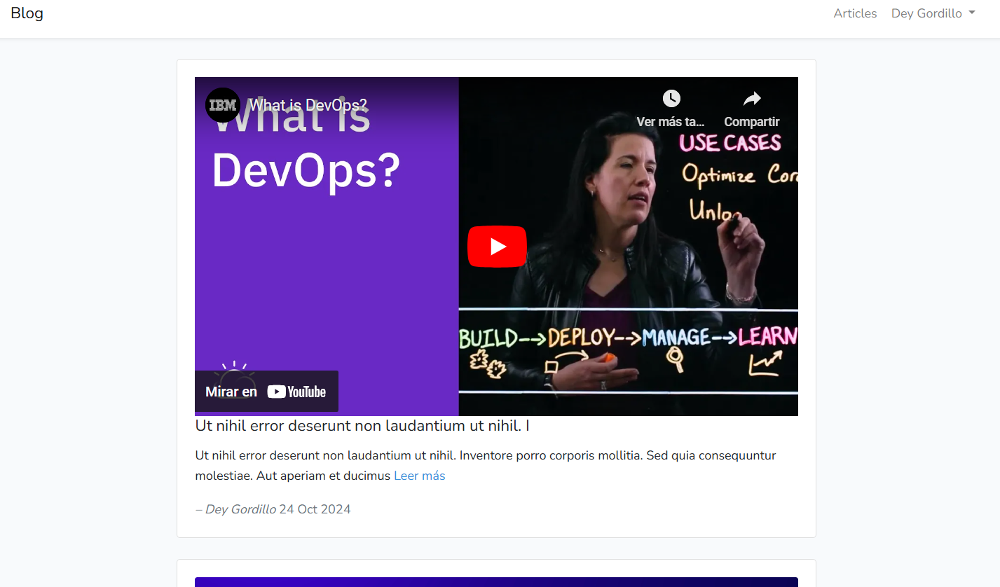

# Blog - Laravel 6
> This is a basic blog created to practice **Laravel 6** where you could create a post and attach an image or show an iframe about that post.



## Project structure
```
.
├── blog # Laravel application source code
├── docker # Docker configuration
├── docker-compose.yml
└── README.md
```

## Environment Setup

1. Clone this repository to your local machine:
 ```bash
 git clone https://github.com/deygordillos/blog-laravel6.git
 cd blog-laravel6
 ```
2. Copy Laravel's .env configuration file and set the environment variables:
```bash
 cp blog/.env.example blog/.env
 ```

Then, ensure that you have variable APP_URL in .env with APP_URL=http://localhost:8180/.
   

## Installation

> [Docker](https://docs.docker.com/get-started/get-docker/) is required. Once you have downloaded it, turn up de container.


### Docker Usage
This project includes a docker-compose.yml file that sets up Docker with the necessary services (_laravel6_app with php 7.4.20 + apache, MySQL database, and phpmyadmin_).

  1. Start the containers:
  ```linux
  docker-compose up -d
  ```
  2. Install Laravel dependencies:
  ```linux
  docker-compose exec laravel6_app composer install
  ```
  3. Run the database migrations and, optionally, the seeders:
  ```linux
  docker-compose exec app php artisan migrate --seed
  ```
  4. You should now be able to access the application at [http://localhost:8180](http://localhost:8180).


## License

[MIT](https://choosealicense.com/licenses/mit/)